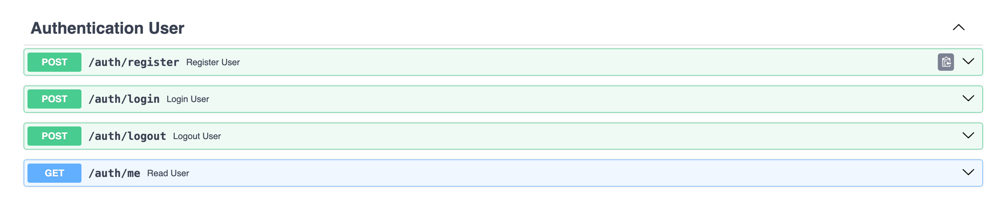

# BookingAPI

This is API designed to manage a booking system for hotels. It supports user authentication, hotel information retrieval, room management, and booking operations. Below is a detailed description of the features and endpoints provided by the API.

## Features

### 1. **Authentication**
- **Register**: Create a new user account.
- **Login**: Authenticate users with their credentials.
- **Logout**: End the current session for a user.
- **Auth Me**: Retrieve user details, including email and password.

### 2. **Hotels**
- Retrieve a list of all available hotels with detailed information.

### 3. **Rooms**
- View information about hotel rooms, including:
  - The associated hotel (using a foreign key).
  - Quantity of available rooms.
  - Price per room.

### 4. **Bookings**
- **Create a Booking**: Reserve rooms in a specific hotel.
- **View Bookings**: Check details of all your bookings.
- **Delete a Booking**: Cancel an existing reservation.

---

## Endpoints

### **Authentication**
| Method | Endpoint       | Description                   |
|--------|----------------|-------------------------------|
| POST   | `/auth/register` | Register a new user.          |
| POST   | `/auth/login`    | Log in an existing user.       |
| POST   | `/auth/logout`   | Log out the current user.      |
| GET    | `/auth/me`       | Retrieve current user details. |

### **Hotels**
| Method | Endpoint             | Description                  |
|--------|----------------------|------------------------------|
| GET    | `/hotels/all_hotels` | Get information about hotels.|

### **Rooms**
| Method | Endpoint            | Description                                                   |
|--------|---------------------|---------------------------------------------------------------|
| GET    | `/rooms/view_rooms` | Get info of particular room or information about all of them. |
     |

### **Bookings**
| Method | Endpoint                   | Description                          |
|--------|----------------------------|--------------------------------------|
| POST   | `/bookings/rooms_amount`   | Create a new booking.                |
| GET    | `/bookings/my_booking`     | Retrieve a list of user bookings.    |
| DELETE | `/bookings/delete_booking` | Delete a specific booking.           |

---

